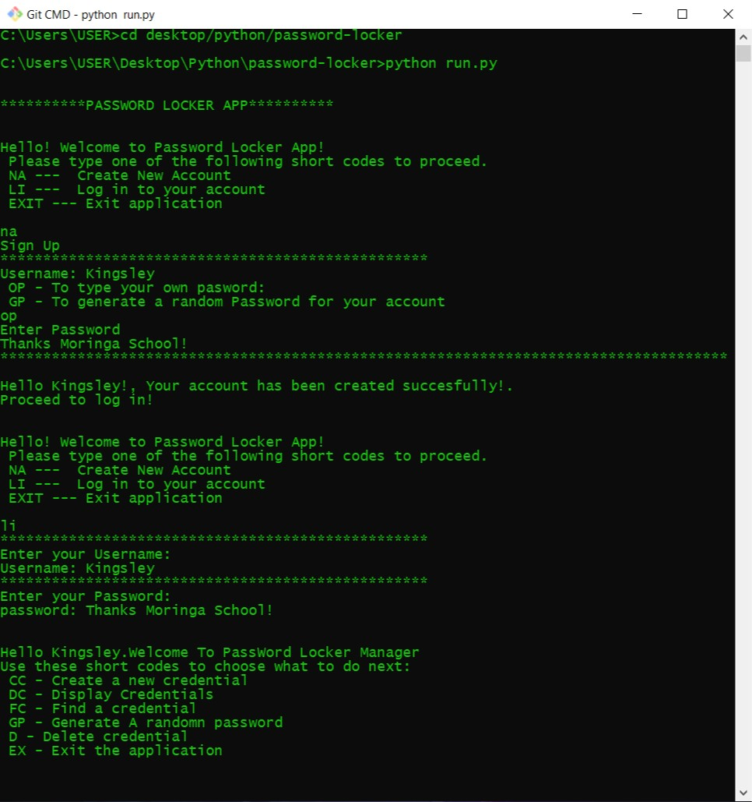

# Password-locker

This project was generated with [Python](https://github.com/python) version 3.7.8
  
#### This is a python application that allows users to create and store credentials. Current version 2020
</table>
</tr>
</td>

#### By **Kingsleymuturi**
  
## Description of functionality:
This app allows users to first of all create an account whereby they will be storing their credentials, having options to delete and save credentials too.
## Access
* Clone the repo and then run the run.py file on your terminal
* You should see something similar to the following image:

## Known Bugs
There are no known bugs yet.
### Development
Want to contribute? Great!

To fix a bug or enhance an existing module, follow these steps:

- Fork the repo
- Create a new branch (`git checkout -b improve-feature`)
- Make the appropriate changes in the files
- Add changes to reflect the changes made
- Commit your changes (`git commit -m 'Improve feature'`)
- Push to the branch (`git push origin improve-feature`)
- Create a Pull Request 

## Technologies Used
During the creation of this webpage I used Python only.
## Support and contact details
In case of anything find me here: kingsleymuturi9@gmail.com feel free to communicate any issue with the webpage

### [LICENSE](https://github.com/Kingsleymuturi/password-locker/blob/master/LICENSE)
Copyright (c) 2020 [Kingsley Muturi ](https://github.com/Kingsleymuturi)
